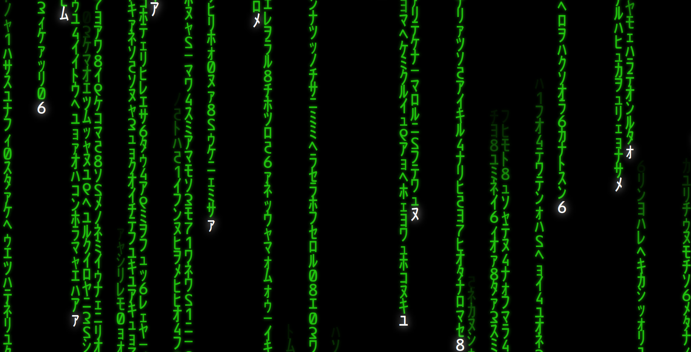

# Matrix Rain React App

A matrix rain screen using React.

## Screenshots:



## Built with:

React.JS

## How to use:

```
Download/Extract
cd MatrixReact
npm install
npm start
```

## Contribute:

Feel free to a fork the repo or notify me of any issues.

## Credit:

Tutorial - https://www.youtube.com/watch?v=qLbQ0NBa5zM

## License:

MIT © BChainDev
